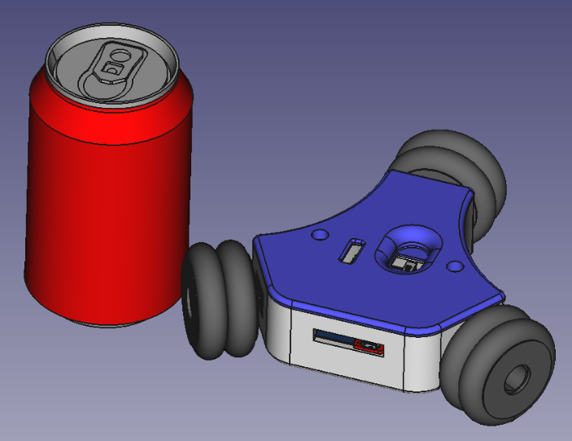
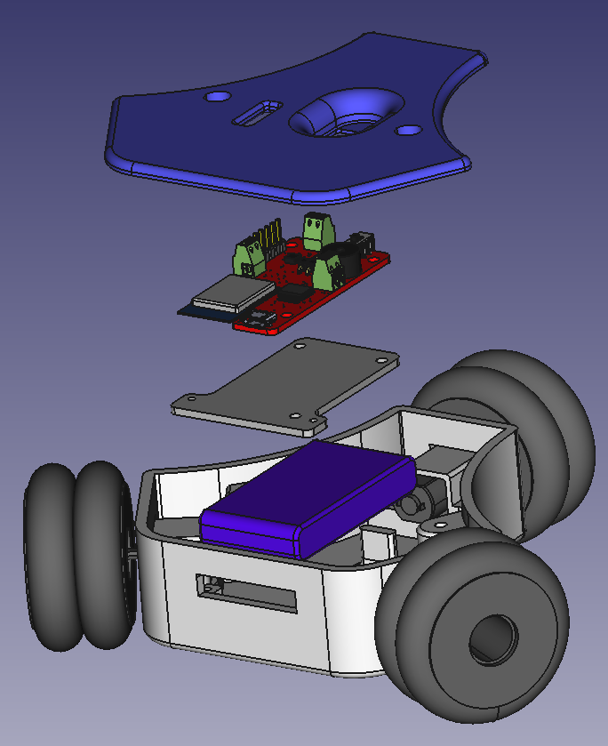

#Mini loki

<p align="center">


</p>

## Hardware

| Hardware  | Description |
| ------------- | ------------- |
| [bqlabs/OmniBoard](https://github.com/bqlabs/OmniBoard) | ESP12 WiFi board with 3 motor drivers and 1s lipo charger |
| [Turnigy nano-tech 460mah 2S 25~40C Lipo Pack](http://www.hobbyking.com/hobbyking/store/uh_viewItem.asp?idProduct=11896) | 460mah 2S 25~40C Lipo Pack |
| [3 x Pololu Micro Metal Gearmotors](https://www.pololu.com/category/60/micro-metal-gearmotors) | Brushed DC gearmotors available in a wide range of gear ratios—from 5:1 up to 1000:1—and with four different motors: high-power with long-life carbon brushes (HPCB), high-power with shorter-life precious metal brushes (HP), medium-power (MP), and low-power. |
| [3x Pololu Micro Metal Gearmotor Bracket Extended](https://www.pololu.com/product/1089) | Pololu Micro Metal Gearmotor Bracket Extended Pair |
| [3x 48mm Omniwheel for LEGO NXT, Servo](http://www.nexusrobot.com/product.php?id_product=82) | Omniwheel for NXT compatible hub or Axle Centre and servo motor |

## Software

<p align="center">


</p>

We use [platformio](http://platformio.org/) to upload the code to the board.

```bash
~/miniloki$ cd code/platformio/miniloki_omniboard
~/miniloki/code/platformio/miniloki_omniboard$ platformio run
```

We use [Python](https://www.python.org/) to control miniloki with a joystick

```bash
~/miniloki$ cd code/python/
~/miniloki/code/python$ python client.py
```

Sponsored by BQ untill March 2016
